# BhumiLink (ভূমিযোগ)

**A Unified Gateway to Land Services**
**ভূমি সেবার একটি সমন্বিত প্রবেশদ্বার**

*Unified Digital Land Transaction and Record Management Platform — LandTech 2026*

> **Project name:** BhumiLink (English) / ভূমিযোগ (Bangla)
> **Tagline:** A Unified Gateway to Land Services / ভূমি সেবার একটি সমন্বিত প্রবেশদ্বার
> **Event:** LandTech 2026 — LandTech Innovation Hackathon, Daffodil International University (DIU)
> **Track:** Digital Land Records, Verification & Digitization
> **Primary alignment:** P4 — Smart e-Mutation & Registry Workflow
> **Supporting alignment:** P2 — Deed & Ownership Verification, P3 — Fraud & Double-Selling Detection
> **Document status:** Pre-SRS project blueprint. Implementation status of every feature is `Planned` until confirmed against the repository.

---

## Table of Contents

1. [Introduction](#1-introduction)
    - [1.1 Purpose](#11-purpose)
    - [1.2 Problem Statement](#12-problem-statement)
    - [1.3 Objectives](#13-objectives)
    - [1.4 Scope](#14-scope)
    - [1.5 System Overview](#15-system-overview)
2. [Overall Description](#2-overall-description)
    - [2.1 Product Perspective](#21-product-perspective)
    - [2.2 User Classes & Characteristics](#22-user-classes--characteristics)
    - [2.3 Operating Environment](#23-operating-environment)
    - [2.4 General System Constraints](#24-general-system-constraints)
3. [Functional Requirements](#3-functional-requirements)
    - [3.1 Public Land Services](#31-public-land-services)
    - [3.2 Land Tax / Bhumi Unnayan Kor](#32-land-tax--bhumi-unnayan-kor)
    - [3.3 CS/RS Record Services](#33-csrs-record-services)
    - [3.4 Deed Preparation](#34-deed-preparation)
    - [3.5 Deed Fee Calculation](#35-deed-fee-calculation)
    - [3.6 Deed Template Management](#36-deed-template-management)
    - [3.7 Sub-Registrar Verification](#37-sub-registrar-verification)
    - [3.8 Digital Dolil](#38-digital-dolil)
    - [3.9 Mutation / Namjari](#39-mutation--namjari)
    - [3.10 RS/BS Record Update](#310-rsbs-record-update)
    - [3.11 Land / Transaction Status](#311-land--transaction-status)
    - [3.12 Double-Selling / Conflict Prevention](#312-double-selling--conflict-prevention)
    - [3.13 Central Payment](#313-central-payment)
    - [3.14 Central Notification](#314-central-notification)
    - [3.15 Reports](#315-reports)
    - [3.16 Notices](#316-notices)
    - [3.17 Land Map](#317-land-map)
    - [3.18 Authentication, Roles & User Management](#318-authentication-roles--user-management)
4. [Functional Specification](#4-functional-specification)
    - [4.1 Public Land Services](#41-public-land-services)
    - [4.2 Land Tax / Bhumi Unnayan Kor](#42-land-tax--bhumi-unnayan-kor)
    - [4.3 CS/RS Record Services](#43-csrs-record-services)
    - [4.4 Deed Preparation](#44-deed-preparation)
    - [4.5 Deed Fee Calculation](#45-deed-fee-calculation)
    - [4.6 Deed Template Management](#46-deed-template-management)
    - [4.7 Sub-Registrar Verification](#47-sub-registrar-verification)
    - [4.8 Digital Dolil](#48-digital-dolil)
    - [4.9 Mutation / Namjari](#49-mutation--namjari)
    - [4.10 RS/BS Record Update](#410-rsbs-record-update)
    - [4.11 Land / Transaction Status](#411-land--transaction-status)
    - [4.12 Double-Selling / Conflict Prevention](#412-double-selling--conflict-prevention)
    - [4.13 Central Payment](#413-central-payment)
    - [4.14 Central Notification](#414-central-notification)
    - [4.15 Reports](#415-reports)
    - [4.16 Notices](#416-notices)
    - [4.17 Land Map](#417-land-map)
    - [4.18 Authentication, Roles & User Management](#418-authentication-roles--user-management)
5. [Module Overview & Business Rules](#5-module-overview--business-rules)
    - [5.1 Public Land Services](#51-public-land-services)
    - [5.2 Land Tax / Bhumi Unnayan Kor](#52-land-tax--bhumi-unnayan-kor)
    - [5.3 CS/RS Record Services](#53-csrs-record-services)
    - [5.4 Deed Preparation](#54-deed-preparation)
    - [5.5 Deed Fee Calculation](#55-deed-fee-calculation)
    - [5.6 Deed Template Management](#56-deed-template-management)
    - [5.7 Sub-Registrar Verification](#57-sub-registrar-verification)
    - [5.8 Digital Dolil](#58-digital-dolil)
    - [5.9 Mutation / Namjari](#59-mutation--namjari)
    - [5.10 RS/BS Record Update](#510-rsbs-record-update)
    - [5.11 Land / Transaction Status](#511-land--transaction-status)
    - [5.12 Double-Selling / Conflict Prevention](#512-double-selling--conflict-prevention)
    - [5.13 Central Payment](#513-central-payment)
    - [5.14 Central Notification](#514-central-notification)
    - [5.15 Reports](#515-reports)
    - [5.16 Notices](#516-notices)
    - [5.17 Land Map](#517-land-map)
    - [5.18 Key Business Rules](#518-key-business-rules)
6. [Roles & Responsibilities](#6-roles--responsibilities)
    - [6.1 Public User / Citizen](#61-public-user--citizen)
    - [6.2 Dolil Lekhok](#62-dolil-lekhok)
    - [6.3 Sub-Registrar](#63-sub-registrar)
    - [6.4 Mutation Officer](#64-mutation-officer)
    - [6.5 Administrator](#65-administrator)
7. [Role-Based Workflow](#7-role-based-workflow)
    - [7.1 Public User Workflow](#71-public-user-workflow)
    - [7.2 Dolil Lekhok Workflow](#72-dolil-lekhok-workflow)
    - [7.3 Sub-Registrar Workflow](#73-sub-registrar-workflow)
    - [7.4 Mutation Officer Workflow](#74-mutation-officer-workflow)
    - [7.5 Administrator Workflow](#75-administrator-workflow)
8. [System Flow Diagram](#8-system-flow-diagram)
    - [8.1 Overall Project System](#81-overall-project-system)
    - [8.2 Public User — Land Tax → Dakhila](#82-public-user--land-tax--dakhila)
    - [8.3 Public User — CS/RS Record Search & Purchase](#83-public-user--csrs-record-search--purchase)
    - [8.4 Public User — Land Map & Transaction Status](#84-public-user--land-map--transaction-status)
    - [8.5 Dolil Lekhok — Deed Preparation & Submission](#85-dolil-lekhok--deed-preparation--submission)
    - [8.6 Sub-Registrar — Deed Verification & Approval](#86-sub-registrar--deed-verification--approval)
    - [8.7 Dolil Lekhok — Apply for Mutation](#87-dolil-lekhok--apply-for-mutation)
    - [8.8 Mutation Officer — Mutation Verification & Approval](#88-mutation-officer--mutation-verification--approval)
    - [8.9 Public User — Land Status / Double-Selling Protection](#89-public-user--land-status--double-selling-protection)
    - [8.10 Administrator — User & Role Management](#810-administrator--user--role-management)
    - [8.11 Administrator — Reports & Monitoring](#811-administrator--reports--monitoring)
9. [Non-Functional Requirements](#9-non-functional-requirements)
    - [9.1 Security](#91-security)
    - [9.2 Performance](#92-performance)
    - [9.3 Usability](#93-usability)
    - [9.4 Reliability](#94-reliability)
    - [9.5 Scalability](#95-scalability)
    - [9.6 Availability](#96-availability)
    - [9.7 Auditability](#97-auditability)
10. [Security & Access Control](#10-security--access-control)

---

## 1. Introduction

### 1.1 Purpose

This README is the **main documentation and product blueprint** for our LandTech 2026 project, BhumiLink (ভূমিযোগ). It serves as the project's feature, workflow, architecture, UI/UX, backend/API, and database planning reference, and it is the foundation for the formal Software Requirements Specification (SRS), which will be written later.

This document is **not** the SRS.

### 1.2 Problem Statement

Deed registration and mutation (Namjari) are currently handled as separate, disconnected processes. As a result:

- Information captured during deed registration is not reused when applying for mutation.
- The same land and ownership information is verified repeatedly by different offices.
- There is no single, connected digital trail from the CS/RS land record to the updated RS/BS record.
- A parcel that is already part of an unresolved transaction or mutation is not clearly flagged to others, which leaves room for double selling, conflicting transactions, and record inconsistency.

### 1.3 Objectives

1. Connect deed registration and mutation into one lifecycle.
2. Reuse verified deed and land information during mutation instead of collecting it again.
3. Give each actor a role-specific workflow with a clear rejection-and-correction loop.
4. Keep land records and transaction status connected, so that conflicting transactions can be detected and prevented under defined business rules.
5. Provide public land services (land tax, Dakhila, CS/RS records, land map) that support the main lifecycle.
6. Keep deed, mutation, payment, approval, rejection, and record-update activity traceable.

### 1.4 Scope

**Core scope — the connected land transaction lifecycle:**

Deed Preparation → Sub-Registrar Verification → Digital Dolil → Mutation → RS/BS Record Update → Current Land / Transaction Status

**Supporting scope:**

- Public services: Land Tax / Bhumi Unnayan Kor and Dakhila, CS/RS records, Land Map, current transaction status
- Central services: Payment, Notification, Reports, Notices

**Out of scope for this document:** the formal SRS, a final database schema, legal rules, official fee schedules, and real government API contracts.

> The project is **not** a generic government e-service portal. Its product idea is the connected land transaction lifecycle.

### 1.5 System Overview

The platform connects deed registration and mutation so information captured earlier can be reused later. The central chain is:

```text
CS/RS → Deed → Digital Dolil → Mutation → RS/BS → Current Transaction Status
```

The full lifecycle:

```text
Deed Preparation
      ↓
Sub-Registrar Verification
      ↓
Deed Approval
      ↓
Digital Dolil Generation
      ↓
Mutation Application
      ↓
Mutation Officer Verification
      ↓
Mutation Approval
      ↓
RS/BS Record Update
      ↓
Current Land / Transaction Status
      ↓
Prevent Conflicting / Duplicate Transactions
```

The overall platform structure is shown in [Section 8.1](#81-overall-project-system).

---

## 2. Overall Description

### 2.1 Product Perspective

The platform is a prototype of a **Unified Digital Land Transaction and Record Management Platform**. It is organized around a Unified Platform that connects Land Services (Mutation, CS/RS Record, Map, Land Tax) and the Sub Register Office (Deed / Legal Document), together with centralized Payment, Notification, Report, and Notice services. It maintains its own platform database of land records and transaction data and does **not** claim integration with real government systems.

### 2.2 User Classes & Characteristics

There are exactly **five** primary user types. No additional operational roles are defined.

| User Class | Description | Main Activities |
| --- | --- | --- |
| Public User / Citizen | General user of public land services | Land tax, Dakhila, CS/RS search, land map, transaction status |
| Dolil Lekhok | Government-licensed deed writer | Prepares and submits deeds, applies for mutation |
| Sub-Registrar | Authority assigned to verify and finalize deeds | Reviews, approves, or rejects deeds |
| Mutation Officer | Authority that verifies and finalizes mutation | Reviews, approves, or rejects mutation applications |
| Administrator | System-level manager | User/role management, monitoring, reports, notices |

### 2.3 Operating Environment

`TBD` — to be completed from the repository.

### 2.4 General System Constraints

- The workflow order must be respected: a Digital Dolil exists only after Sub-Registrar approval, and mutation starts only from an approved Digital Dolil.
- Users can access only the workflows and records appropriate to their role.
- No legal rules, government processes, or official fee schedules are assumed beyond what the project defines.
- Prototype data is mock/demo data unless stated otherwise.

---

## 3. Functional Requirements

> **Status legend:** `Planned` = defined, implementation not yet confirmed. Update to `Implemented` or `Partial` after checking the repository.

### 3.1 Public Land Services

| ID | Requirement | Status |
| --- | --- | --- |
| FR-01 | The system shall provide Public Users with land tax, CS/RS record, land map, and transaction-status services. | Planned |

### 3.2 Land Tax / Bhumi Unnayan Kor

| ID | Requirement | Status |
| --- | --- | --- |
| FR-02 | A Public User shall be able to enter land information for land tax calculation. | Planned |
| FR-03 | The system shall calculate the land tax and let the user review the amount before payment. | Planned |
| FR-04 | After successful payment, the system shall generate a Dakhila. | Planned |
| FR-05 | The user shall be able to view and download the Dakhila. | Planned |

### 3.3 CS/RS Record Services

| ID | Requirement | Status |
| --- | --- | --- |
| FR-06 | A Public User shall be able to search CS/RS records; if no record is found, the system shall show a "no record found" result. | Planned |
| FR-07 | The user shall be able to view available record information for a found record. | Planned |
| FR-08 | The user shall be able to request an official copy and pay the applicable record fee. | Planned |
| FR-09 | After payment, the system shall generate the official record and let the user view/download it. | Planned |

### 3.4 Deed Preparation

| ID | Requirement | Status |
| --- | --- | --- |
| FR-10 | A Dolil Lekhok shall be able to log in and create a new deed application. | Planned |
| FR-11 | The Dolil Lekhok shall be able to select the deed type. | Planned |
| FR-12 | The Dolil Lekhok shall be able to enter initial deed information and provide the required documents. | Planned |
| FR-13 | The system shall offer exactly two ways to supply CS/RS information: **Upload** (PDF/DOCX) or **Import from Platform Database**. | Planned |
| FR-14 | For upload, the Dolil Lekhok shall be able to upload the CS/RS record as a PDF or DOCX file. | Planned |
| FR-15 | For import, the Dolil Lekhok shall be able to search and select the relevant CS/RS record in the platform database. | Planned |
| FR-16 | Importing a record from the platform database shall require payment of the applicable CS/RS import fee before the record is imported. | Planned |
| FR-17 | The Dolil Lekhok shall be able to review the completed deed, pay the applicable deed fees, and submit it to the assigned Sub-Registrar. | Planned |
| FR-18 | After submission, the application shall be marked as under verification. | Planned |

### 3.5 Deed Fee Calculation

| ID | Requirement | Status |
| --- | --- | --- |
| FR-19 | The system shall collect the additional information required for deed-fee calculation. | Planned |
| FR-20 | The system shall calculate the applicable deed fee from the information entered. | Planned |

### 3.6 Deed Template Management

| ID | Requirement | Status |
| --- | --- | --- |
| FR-21 | The system shall generate the appropriate deed template based on the selected deed type. | Planned |
| FR-22 | The Dolil Lekhok shall be able to edit, modify, and complete the generated template. | Planned |

### 3.7 Sub-Registrar Verification

| ID | Requirement | Status |
| --- | --- | --- |
| FR-23 | Submitted applications shall appear in the assigned Sub-Registrar's portal. | Planned |
| FR-24 | The Sub-Registrar shall be able to open an application, review deed information, and verify supporting documents. | Planned |
| FR-25 | The Sub-Registrar shall be able to verify the CS/RS record and re-check deed details. | Planned |
| FR-26 | The Sub-Registrar shall be able to approve or reject the deed. | Planned |
| FR-27 | On rejection, the Sub-Registrar shall enter a rejection reason / required changes, and the Dolil Lekhok shall be notified. | Planned |
| FR-28 | The Dolil Lekhok shall be able to correct and resubmit the deed, and the Sub-Registrar shall be able to review the resubmission. | Planned |

### 3.8 Digital Dolil

| ID | Requirement | Status |
| --- | --- | --- |
| FR-29 | On approval, the system shall generate a Digital Dolil. | Planned |
| FR-30 | The system shall store the Digital Dolil in the database. | Planned |
| FR-31 | The system shall add the Digital Dolil to the Dolil Lekhok dashboard. | Planned |
| FR-32 | The system shall notify the Dolil Lekhok when the Digital Dolil is generated. | Planned |

### 3.9 Mutation / Namjari

| ID | Requirement | Status |
| --- | --- | --- |
| FR-33 | The system shall send the Dolil Lekhok a mutation reminder/notification after the Digital Dolil is generated. | Planned |
| FR-34 | The Dolil Lekhok shall be able to open the approved Digital Dolil from the dashboard and start a mutation application. | Planned |
| FR-35 | The system shall automatically attach the approved Digital Dolil and the relevant CS/RS record to the mutation application. | Planned |
| FR-36 | The Dolil Lekhok shall be able to pay the mutation fee and submit the mutation request, which is sent to the Mutation Officer. | Planned |
| FR-37 | The Mutation Officer shall be able to view and open mutation applications. | Planned |
| FR-38 | The Mutation Officer shall be able to review the registered Digital Dolil and the existing CS/RS record. | Planned |
| FR-39 | The Mutation Officer shall be able to verify ownership information and land information. | Planned |
| FR-40 | The Mutation Officer shall be able to check the existing transaction/mutation status. | Planned |
| FR-41 | The Mutation Officer shall be able to approve or reject the mutation. | Planned |
| FR-42 | On rejection, the Mutation Officer shall enter a rejection reason / required changes, and the Dolil Lekhok shall be notified. | Planned |
| FR-43 | The Dolil Lekhok shall be able to correct and resubmit the mutation application, and the Mutation Officer shall be able to review the resubmission. | Planned |

### 3.10 RS/BS Record Update

| ID | Requirement | Status |
| --- | --- | --- |
| FR-44 | On mutation approval, the system shall update the RS/BS record. | Planned |
| FR-45 | After the update, the system shall notify the Dolil Lekhok. | Planned |

### 3.11 Land / Transaction Status

| ID | Requirement | Status |
| --- | --- | --- |
| FR-46 | The system shall maintain a current transaction status for each land record, such as Available, Mutation in Progress, Transferred / Updated, or Restricted. | Planned |
| FR-47 | On mutation approval, the system shall update the current land transaction status. | Planned |
| FR-48 | Public Users shall be able to view the land record, current ownership (where supported), and current transaction status. | Planned |

### 3.12 Double-Selling / Conflict Prevention

| ID | Requirement | Status |
| --- | --- | --- |
| FR-49 | When a land record is searched, the system shall check and show its current transaction status. | Planned |
| FR-50 | If a parcel has an unresolved mutation/transaction, the system shall show a warning and flag the parcel as not usable for a new registration, according to the defined business rules. | Planned |
| FR-51 | For a parcel marked as transferred/updated, the system shall show the updated ownership. | Planned |

### 3.13 Central Payment

| ID | Requirement | Status |
| --- | --- | --- |
| FR-52 | The system shall provide a centralized payment service for land tax, CS/RS record fee, CS/RS import fee, deed fees, and mutation fees. | Planned |
| FR-53 | A workflow step that requires payment shall proceed only after successful payment. | Planned |

### 3.14 Central Notification

| ID | Requirement | Status |
| --- | --- | --- |
| FR-54 | The system shall send notifications for submission, rejection, approval, Digital Dolil generation, mutation reminder, mutation submission, mutation rejection, mutation approval, and RS/BS update. | Planned |

### 3.15 Reports

| ID | Requirement | Status |
| --- | --- | --- |
| FR-55 | The Administrator shall be able to open an admin dashboard and view system activity. | Planned |
| FR-56 | The Administrator shall be able to view deed, mutation, payment, and rejection/processing statistics. | Planned |
| FR-57 | The Administrator shall be able to generate reports. | Planned |

### 3.16 Notices

| ID | Requirement | Status |
| --- | --- | --- |
| FR-58 | The Administrator shall be able to manage notices and announcements, and users shall be able to view them. | Planned |

### 3.17 Land Map

| ID | Requirement | Status |
| --- | --- | --- |
| FR-59 | A Public User shall be able to open the land map, search for land, and locate a parcel. | Planned |
| FR-60 | The user shall be able to view the parcel's land record, linked land information where supported, and current transaction status. | Planned |

### 3.18 Authentication, Roles & User Management

| ID | Requirement | Status |
| --- | --- | --- |
| FR-61 | The system shall authenticate users and restrict access according to role (Public User, Dolil Lekhok, Sub-Registrar, Mutation Officer, Administrator). | Planned |
| FR-62 | The system shall provide role-specific dashboards. | Planned |
| FR-63 | The Administrator shall be able to create, update, and deactivate users and assign/update roles. | Planned |

---

## 4. Functional Specification

This section provides a short description of each of the 63 Functional Requirements defined in [Section 3](#3-functional-requirements). The FR numbering is aligned exactly with Section 3, and the formal requirement statements are not repeated here.

### 4.1 Public Land Services

FR-01: This feature allows Public Users to access land-related services such as land tax, CS/RS records, land maps, and transaction status. It provides a centralized digital channel for accessing land services and improves transparency and accessibility.

### 4.2 Land Tax / Bhumi Unnayan Kor

FR-02: This feature allows Public Users to enter land information as the starting point of the land tax process. It ensures the system has the details needed to calculate the tax accurately.

FR-03: This feature calculates the land tax from the information entered and lets the Public User review the amount before paying. It gives users clarity on the payable amount in advance and supports transparency.

FR-04: This feature generates a Dakhila for the Public User once the land tax payment is successful. It provides a payment-backed document that serves as an important supporting document for land registration.

FR-05: This feature allows Public Users to view and download their Dakhila. It gives convenient access to the document whenever it is needed.

### 4.3 CS/RS Record Services

FR-06: This feature allows Public Users to search CS/RS records and clearly informs them when no matching record is found. It helps users quickly determine whether a record is available in the platform.

FR-07: This feature allows Public Users to view the available information of a CS/RS record that has been found. It lets users examine the record details before deciding to request an official copy.

FR-08: This feature allows Public Users to request an official copy of a CS/RS record and pay the applicable record fee. It provides a controlled, payment-based route for obtaining official land records.

FR-09: This feature generates the official CS/RS record after payment and lets the Public User view or download it. It ensures the official record is issued only after the fee is paid and remains easily accessible.

### 4.4 Deed Preparation

FR-10: This feature allows a Dolil Lekhok to log in and create a new deed application. It is the starting point of the deed workflow and restricts deed creation to the licensed deed writer.

FR-11: This feature allows the Dolil Lekhok to select the deed type for the application. It ensures each deed begins under the correct category for the transaction being recorded.

FR-12: This feature allows the Dolil Lekhok to enter the initial deed information and provide the required documents. It ensures the application contains the essential details and supporting documents before it moves forward.

FR-13: This feature offers the Dolil Lekhok exactly two ways to supply CS/RS information: uploading a PDF or DOCX file, or importing the record from the platform database. It gives a clear choice of record source while keeping the deed preparation process consistent.

FR-14: This feature covers the upload option, in which the Dolil Lekhok uploads the CS/RS record as a PDF or DOCX file. It supports cases where the Dolil Lekhok already holds the record as a document outside the platform.

FR-15: This feature covers the import option, in which the Dolil Lekhok searches for and selects the relevant CS/RS record in the platform database. It allows the deed to use the platform's own record instead of a separately supplied file.

FR-16: This feature requires the Dolil Lekhok to pay the applicable CS/RS import fee before a record selected from the platform database is imported. It applies to the import option only and ensures the record is imported into the deed only after payment is completed.

FR-17: This feature allows the Dolil Lekhok to review the completed deed, pay the applicable deed fees, and submit it to the assigned Sub-Registrar. It provides a final check before formal handover for verification.

FR-18: This feature marks the deed application as under verification once it has been submitted. It lets the Dolil Lekhok see that the application has been received and is awaiting review.

### 4.5 Deed Fee Calculation

FR-19: This feature collects the additional information required to calculate the deed fee. It ensures the fee is based on the transaction details entered by the Dolil Lekhok.

FR-20: This feature calculates the applicable deed fee from the information entered. It gives the Dolil Lekhok the amount to be paid for the deed without manual calculation.

### 4.6 Deed Template Management

FR-21: This feature generates the appropriate deed template based on the selected deed type. It gives the Dolil Lekhok a suitable starting document for the transaction and reduces drafting effort.

FR-22: This feature allows the Dolil Lekhok to edit, modify, and complete the generated template. It lets the deed be adapted to the specific details of the transaction before review and submission.

### 4.7 Sub-Registrar Verification

FR-23: This feature makes submitted deed applications appear in the portal of the assigned Sub-Registrar. It ensures each deed reaches the responsible authority for review.

FR-24: This feature allows the Sub-Registrar to open an application, review the deed information, and verify the supporting documents. It enables a thorough examination of the deed and its evidence before a decision is made.

FR-25: This feature allows the Sub-Registrar to verify the CS/RS record and re-check the deed details. It helps confirm that the deed is consistent with the land record it relies on.

FR-26: This feature allows the Sub-Registrar to approve or reject the deed. It is the formal decision point that determines whether the deed proceeds to Digital Dolil generation.

FR-27: This feature requires the Sub-Registrar to enter a rejection reason or required changes when rejecting a deed, and notifies the Dolil Lekhok. It gives the Dolil Lekhok clear guidance on what must be corrected.

FR-28: This feature allows the Dolil Lekhok to correct and resubmit a rejected deed, and the Sub-Registrar to review the resubmission. It completes the rejection-and-correction loop so that deficiencies can be resolved within the same workflow.

### 4.8 Digital Dolil

FR-29: This feature generates a Digital Dolil when the Sub-Registrar approves a deed. It ensures that only a verified deed becomes a Digital Dolil.

FR-30: This feature stores the generated Digital Dolil in the system. It preserves the approved deed so that it can be retrieved and reused later, including in the mutation process.

FR-31: This feature adds the Digital Dolil to the Dolil Lekhok dashboard. It gives the Dolil Lekhok direct access to the approved deed, from which mutation can be started.

FR-32: This feature notifies the Dolil Lekhok when the Digital Dolil has been generated. It keeps the Dolil Lekhok informed that deed approval is complete.

### 4.9 Mutation / Namjari

FR-33: This feature sends the Dolil Lekhok a mutation reminder after the Digital Dolil is generated. It prompts the Dolil Lekhok to proceed from deed registration to mutation.

FR-34: This feature allows the Dolil Lekhok to open the approved Digital Dolil from the dashboard and start a mutation application. It connects deed registration directly to the mutation process.

FR-35: This feature automatically attaches the approved Digital Dolil and the relevant CS/RS record to the mutation application. It reuses information that has already been verified, so the Dolil Lekhok does not need to provide it again.

FR-36: This feature allows the Dolil Lekhok to pay the mutation fee and submit the mutation request, which is then sent to the Mutation Officer. It formally places the application in the Mutation Officer's queue once payment is complete.

FR-37: This feature allows the Mutation Officer to view and open mutation applications. It gives the Mutation Officer access to the applications awaiting review.

FR-38: This feature allows the Mutation Officer to review the registered Digital Dolil and the existing CS/RS record. It provides the core documents needed to assess the mutation request.

FR-39: This feature allows the Mutation Officer to verify the ownership information and land information. It helps ensure the mutation is based on accurate and consistent details.

FR-40: This feature allows the Mutation Officer to check the existing transaction or mutation status of the land. It helps identify conflicting or unresolved activity on the parcel before a decision is made.

FR-41: This feature allows the Mutation Officer to approve or reject the mutation. It is the formal decision point that determines whether the land record will be updated.

FR-42: This feature requires the Mutation Officer to enter a rejection reason or required changes when rejecting a mutation, and notifies the Dolil Lekhok. It gives clear guidance on what must be corrected.

FR-43: This feature allows the Dolil Lekhok to correct and resubmit a rejected mutation application, and the Mutation Officer to review the resubmission. It completes the mutation rejection-and-correction loop within the same workflow.

### 4.10 RS/BS Record Update

FR-44: This feature updates the RS/BS record when a mutation is approved. It ensures the land record reflects the completed transaction and that records change only through an approved mutation.

FR-45: This feature notifies the Dolil Lekhok after the RS/BS record has been updated. It confirms that the mutation process has been completed.

### 4.11 Land / Transaction Status

FR-46: This feature maintains a current transaction status for each land record, such as Available, Mutation in Progress, Transferred / Updated, or Restricted. It makes the present state of a parcel clear to the users who rely on it.

FR-47: This feature updates the current land transaction status when a mutation is approved. It keeps the visible status consistent with the latest completed transaction.

FR-48: This feature allows Public Users to view the land record, the current ownership where supported, and the current transaction status. It improves transparency for citizens and potential buyers.

### 4.12 Double-Selling / Conflict Prevention

FR-49: This feature checks and shows the current transaction status whenever a land record is searched. It lets users, including potential buyers, see the status of a parcel at the time they look it up.

FR-50: This feature shows a warning and flags a parcel as not usable for a new registration when it has an unresolved mutation or transaction, according to the defined business rules. It helps detect and prevent double selling and conflicting transactions.

FR-51: This feature shows the updated ownership for a parcel marked as transferred or updated. It ensures users see the current owner after a completed transaction.

### 4.13 Central Payment

FR-52: This feature provides a centralized payment service for land tax, the CS/RS record fee, the CS/RS import fee, deed fees, and mutation fees. It gives Public Users and Dolil Lekhoks a single, consistent way to pay across services.

FR-53: This feature allows a workflow step that requires payment to proceed only after the payment is successful. It ensures that paid services are not completed without the corresponding payment.

### 4.14 Central Notification

FR-54: This feature sends notifications for key workflow events: submission, rejection, approval, Digital Dolil generation, mutation reminder, mutation submission, mutation rejection, mutation approval, and RS/BS update. It keeps users informed of progress and of actions required from them.

### 4.15 Reports

FR-55: This feature allows the Administrator to open an admin dashboard and view system activity. It gives the Administrator an overview for monitoring the platform.

FR-56: This feature allows the Administrator to view deed, mutation, payment, and rejection/processing statistics. It supports monitoring of workload and processing outcomes.

FR-57: This feature allows the Administrator to generate reports. It supports record-keeping and review of system activity.

### 4.16 Notices

FR-58: This feature allows the Administrator to manage notices and announcements, and allows users to view them. It provides a channel for sharing important information with platform users.

### 4.17 Land Map

FR-59: This feature allows Public Users to open the land map, search for land, and locate a parcel. It gives users a visual way to find a specific piece of land.

FR-60: This feature allows Public Users to view a parcel's land record, linked land information where supported, and current transaction status. It brings the key details of a parcel together in one place.

### 4.18 Authentication, Roles & User Management

FR-61: This feature authenticates users and restricts access according to their role: Public User, Dolil Lekhok, Sub-Registrar, Mutation Officer, or Administrator. It ensures each user can access only the workflows and records appropriate to their role.

FR-62: This feature provides role-specific dashboards. It presents each user with the workflows relevant to their role.

FR-63: This feature allows the Administrator to create, update, and deactivate users and to assign or update roles. It enables controlled management of platform users and their access.

---

## 5. Module Overview & Business Rules

Each module answers: what it is, who uses it, what happens, what the result is, what it connects to, and why it matters.

### 5.1 Public Land Services

- **What:** The set of public-facing services — Land Tax, CS/RS Record, Land Map, and Transaction Status.
- **Who:** Public Users / Citizens.
- **What happens:** The user picks a service and follows its workflow ([8.2](#82-public-user--land-tax--dakhila) to [8.4](#84-public-user--land-map--transaction-status)).
- **Result:** A Dakhila, an official CS/RS record, or land and status information.
- **Connects to:** Central Payment, CS/RS Record, Land Map, Transaction Status.
- **Why it matters:** These services support the main lifecycle and make land status visible to potential buyers.

### 5.2 Land Tax / Bhumi Unnayan Kor

- **What:** Land tax calculation and payment, leading to a Dakhila.
- **Who:** Public Users.
- **What happens:** Enter land information → system calculates tax → review amount → pay → Dakhila generated → view/download.
- **Result:** A Dakhila.
- **Connects to:** Central Payment.
- **Why it matters:** **Dakhila is an important supporting document for land registration.**

### 5.3 CS/RS Record Services

- **What:** Search and purchase of CS/RS records from the platform database.
- **Who:** Public Users; the same data is later used by the Dolil Lekhok, Sub-Registrar, and Mutation Officer.
- **What happens:** Search → record found? → view information → request official copy → pay record fee → official record generated → view/download.
- **Result:** An official CS/RS record.
- **Connects to:** Central Payment, Deed Preparation (import), Sub-Registrar Verification, Mutation Verification.
- **Why it matters:** CS/RS is the **starting point** of the chain.

### 5.4 Deed Preparation

- **What:** Creation and completion of a deed by a licensed Dolil Lekhok.
- **Who:** Dolil Lekhok.
- **What happens:** Login → create deed → select deed type → enter initial information → provide documents → enter fee-calculation information → system calculates deed fee → supply CS/RS (**Upload OR Import**) → template generated → edit and complete → review → pay deed fees → submit to assigned Sub-Registrar.
- **Result:** A submitted deed application, under verification.
- **Connects to:** CS/RS Records, Deed Fee Calculation, Template Management, Central Payment, Sub-Registrar Verification.
- **Why it matters:** It captures verified information once so it can be reused later.

**CS/RS record input — exactly two options:**

```text
CS/RS Record Source
      │
 ┌────┴──────────────────────┐
 │                           │
Upload                  Import from Platform Database
PDF / DOCX              Search / Select CS/RS Record
                              ↓
                        Pay CS/RS Import Fee
                              ↓
                        Import Record
```

> This is a choice of **source**, not an availability yes/no decision. The database-import path is a paid option.

### 5.5 Deed Fee Calculation

- **What:** Calculation of the applicable deed fee.
- **Who:** Triggered by the Dolil Lekhok; performed by the system.
- **What happens:** The system calculates the fee from the additional information entered for the transaction.
- **Result:** The deed fee to be paid before submission.
- **Connects to:** Deed Preparation, Central Payment.
- **Why it matters:** Fees follow the entered transaction information; no official fee schedule is assumed here.

### 5.6 Deed Template Management

- **What:** Generation and editing of the deed document.
- **Who:** System (generation), Dolil Lekhok (editing).
- **What happens:** The appropriate template is generated from the deed type; the Dolil Lekhok edits, modifies, and completes it.
- **Result:** A completed deed ready for review and submission.
- **Connects to:** Deed Preparation, Sub-Registrar Verification.
- **Why it matters:** The template depends on the deed type, so each deed starts from the right form.

### 5.7 Sub-Registrar Verification

- **What:** Review and finalization of submitted deeds.
- **Who:** Sub-Registrar.
- **What happens:** View assigned applications → open → review deed information → verify supporting documents → verify CS/RS record → recheck deed details → approve or reject. Rejection returns to the Dolil Lekhok with required changes; the corrected deed is resubmitted and reviewed again.
- **Result:** An approved deed (leading to a Digital Dolil) or a rejection with correction instructions.
- **Connects to:** Deed Preparation, Digital Dolil, Notification.
- **Why it matters:** Only a verified deed becomes a Digital Dolil.

### 5.8 Digital Dolil

- **What:** The system-generated digital deed created after approval.
- **Who:** Generated by the system; accessed by the Dolil Lekhok; later reviewed by the Mutation Officer.
- **What happens:** After successful Sub-Registrar approval, the system generates a Digital Dolil, **stores it in the database, and adds it to the Dolil Lekhok dashboard**; the Dolil Lekhok is notified.
- **Result:** A stored, dashboard-accessible Digital Dolil.
- **Connects to:** Sub-Registrar Verification, Mutation, Notification.
- **Why it matters:** It becomes a **primary input for the mutation workflow**.

### 5.9 Mutation / Namjari

- **What:** Application and verification for transferring the land record after registration.
- **Who:** Dolil Lekhok (applies), Mutation Officer (verifies).
- **What happens:** The Dolil Lekhok receives a mutation reminder, opens the approved Digital Dolil from the dashboard, and starts a mutation application. The Digital Dolil and relevant CS/RS record are attached automatically; the mutation fee is paid; the request goes to the Mutation Officer. The Mutation Officer reviews the Digital Dolil and CS/RS record, verifies ownership and land information, checks existing transaction/mutation status, then approves or rejects. Rejection returns for correction and resubmission.
- **Result:** An approved mutation, or a rejection with correction instructions.
- **Connects to:** Digital Dolil, CS/RS Records, Central Payment, RS/BS Update, Transaction Status.
- **Why it matters:** Mutation **reuses data from deed registration** rather than making the Dolil Lekhok enter everything again.

> Mutation status is available through the current land record/status. A separate standalone "Mutation Search" module is intentionally not created.

### 5.10 RS/BS Record Update

- **What:** Updating the land record after mutation approval.
- **Who:** Triggered by the Mutation Officer's approval; performed by the system.
- **What happens:** The RS/BS record is updated, the current land transaction status is updated, and the Dolil Lekhok is notified.
- **Result:** A land record that reflects the completed transaction.
- **Connects to:** Mutation, Transaction Status, Notification.
- **Why it matters:** It closes the lifecycle.

### 5.11 Land / Transaction Status

- **What:** A status connected to each land record.
- **Who:** Maintained by the system; viewed by Public Users and checked by the Mutation Officer.
- **What happens:** The status shows values such as **Available**, **Mutation in Progress**, **Transferred / Updated**, or **Restricted**, and changes as the workflow progresses.
- **Result:** A current, visible status for the parcel.
- **Connects to:** Mutation, RS/BS Update, Land Map, Conflict Prevention.
- **Why it matters:** It is what makes conflicting transactions visible.

### 5.12 Double-Selling / Conflict Prevention

- **What:** A mechanism for **detecting and preventing conflicting transactions based on recorded land and transaction status.**
- **Who:** The system, applied when a land record is searched and during verification.
- **What happens:** The system retrieves the current record and checks transaction status. If a mutation is in progress, it shows a warning and the land cannot be used for a new registration; other statuses show the appropriate information.
- **Result:** A flagged parcel, or a clear status.
- **Connects to:** Transaction Status, Land Map, Deed Preparation, Mutation Verification.
- **Why it matters:** It addresses double selling and conflicting transactions. It does **not** claim to completely eliminate fraud.

### 5.13 Central Payment

Used for land tax, CS/RS record fee, CS/RS import fee, deed fees, and mutation fees. No additional fees are defined. It is a supporting system, not a user type.

### 5.14 Central Notification

Used for submission, rejection, approval, Digital Dolil generation, mutation reminder, mutation submission, mutation rejection, mutation approval, and RS/BS update. It is a supporting system, not a user type.

### 5.15 Reports

Used for system activity, deed/mutation/payment/rejection statistics, and report generation by the Administrator. It is a supporting system, not a user type.

### 5.16 Notices

Used for notices and announcements. It is a supporting system, not a user type.

### 5.17 Land Map

Lets Public Users open the map, search land, locate a parcel, view the land record and ownership, and see transaction status.

### 5.18 Key Business Rules

- A deed needs the required information and documents before submission.
- Deed fees are calculated from the entered transaction information and are paid before submission.
- CS/RS information comes from **either** PDF/DOCX upload **or** platform database import; import requires payment.
- The deed template depends on the deed type and can be edited by the Dolil Lekhok.
- A submitted deed is reviewed by the assigned Sub-Registrar; rejection returns it for correction and resubmission.
- An approved deed produces a Digital Dolil, which is stored and added to the Dolil Lekhok dashboard.
- Mutation reuses the approved Digital Dolil and the relevant CS/RS record, and is reviewed by the Mutation Officer.
- Rejected mutation applications return for correction and resubmission.
- Approved mutation updates the RS/BS record and the current transaction status.
- A parcel with an unresolved transaction/mutation can be flagged and blocked from a new registration, according to the defined business rules.

---

## 6. Roles & Responsibilities

| User Class | Description | Main Activities |
| --- | --- | --- |
| Public User / Citizen | General user of public land services | Land tax, Dakhila, CS/RS search and purchase, land map, transaction status |
| Dolil Lekhok | Government-licensed deed writer | Deed preparation and submission, corrections, mutation application |
| Sub-Registrar | Authority assigned to verify and finalize deeds | Deed review, approval, rejection, Digital Dolil trigger |
| Mutation Officer | Authority that verifies and finalizes mutation | Mutation review, approval, rejection, RS/BS update trigger |
| Administrator | System-level manager | Users and roles, monitoring, reports, notices, configuration |

### 6.1 Public User / Citizen

- Calculate land tax / Bhumi Unnayan Kor, pay, and generate Dakhila
- Search CS/RS records, request official records, and pay record fees
- Search/locate land on the map and view land information and current ownership where supported
- View current transaction status and see warnings for active mutation/conflicting transaction states

### 6.2 Dolil Lekhok

A **government-licensed deed writer.**

- Create deed applications; select deed type; enter deed and fee-calculation information; provide required documents
- Upload CS/RS PDF/DOCX **or** import CS/RS from the platform database (paying the import fee)
- Generate, edit, and complete the deed template; pay deed fees; submit to the assigned Sub-Registrar
- Receive rejection/correction instructions; correct and resubmit
- Access approved Digital Dolils from the dashboard; receive the mutation reminder
- Apply for mutation; pay the mutation fee; submit; correct and resubmit if rejected
- Receive mutation completion notifications

### 6.3 Sub-Registrar

- View assigned deed applications; review information and supporting documents
- Verify CS/RS information; re-check deeds
- Approve or reject, with rejection reasons/correction instructions
- Review resubmissions and approve corrected deeds
- Trigger Digital Dolil generation

### 6.4 Mutation Officer

- View mutation applications; review the registered Digital Dolil and CS/RS record
- Verify ownership and land information; check transaction/mutation status
- Approve or reject, with correction instructions; review resubmissions
- Trigger the RS/BS update

### 6.5 Administrator

- Manage users and roles
- Monitor system activity
- View/generate reports
- Manage notices
- Perform administrative configuration

---

## 7. Role-Based Workflow

Each role's workflow is drawn in [Section 8](#8-system-flow-diagram). This section maps roles to those diagrams.

### 7.1 Public User Workflow

| Workflow | Diagram |
| --- | --- |
| Land Tax → Dakhila | [8.2](#82-public-user--land-tax--dakhila) |
| CS/RS Record Search & Purchase | [8.3](#83-public-user--csrs-record-search--purchase) |
| Land Map & Transaction Status | [8.4](#84-public-user--land-map--transaction-status) |
| Land Status / Double-Selling Protection | [8.9](#89-public-user--land-status--double-selling-protection) |

### 7.2 Dolil Lekhok Workflow

| Workflow | Diagram |
| --- | --- |
| Deed Preparation & Submission | [8.5](#85-dolil-lekhok--deed-preparation--submission) |
| Rejection and correction loop (handled with the Sub-Registrar) | [8.6](#86-sub-registrar--deed-verification--approval) |
| Apply for Mutation | [8.7](#87-dolil-lekhok--apply-for-mutation) |
| Mutation rejection and correction loop (handled with the Mutation Officer) | [8.8](#88-mutation-officer--mutation-verification--approval) |

### 7.3 Sub-Registrar Workflow

Deed Verification & Approval, including the correction loop and Digital Dolil generation: [8.6](#86-sub-registrar--deed-verification--approval).

### 7.4 Mutation Officer Workflow

Mutation Verification & Approval, including the correction loop and RS/BS update: [8.8](#88-mutation-officer--mutation-verification--approval).

### 7.5 Administrator Workflow

| Workflow | Diagram |
| --- | --- |
| User & Role Management | [8.10](#810-administrator--user--role-management) |
| Reports & Monitoring | [8.11](#811-administrator--reports--monitoring) |

---

## 8. System Flow Diagram

> The Mermaid diagrams in this section (8.1 to 8.11) are the project's finalized diagrams and are included exactly as supplied.

### 8.1 Overall Project System

The **Unified Platform** connects **Land Services** and the **Sub Register Office**, along with the centralized **Payment**, **Notification**, **Report**, and **Notice** services. Land Services contains **Mutation**, **CS/RS Record**, **Map**, and **Land Tax / Bhumi Unnayan Kor**. The Sub Register Office handles the **Deed / Legal Document**.

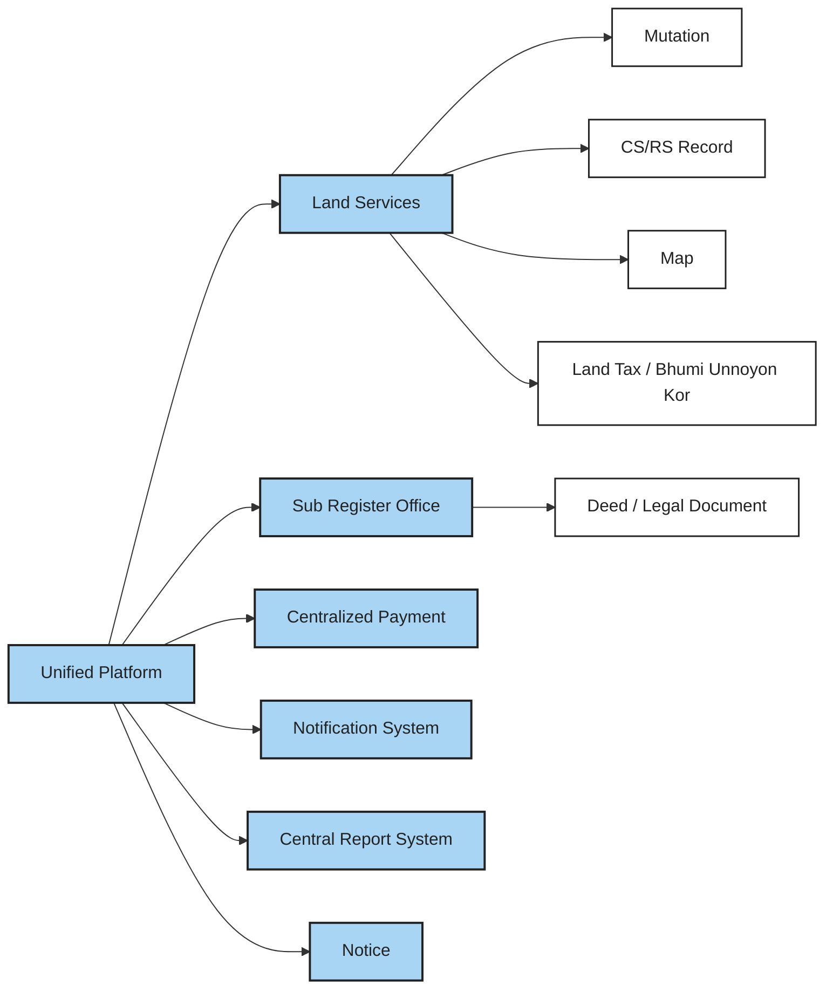

### 8.2 Public User — Land Tax → Dakhila

A Public User enters land information, the system calculates the land tax, and after payment a Dakhila is generated for viewing/download. Dakhila is an important supporting document for land registration.

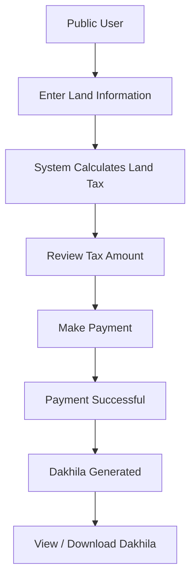

### 8.3 Public User — CS/RS Record Search & Purchase

A Public User searches for a CS/RS record, views its information, requests an official copy, pays the record fee, and views/downloads the official record.

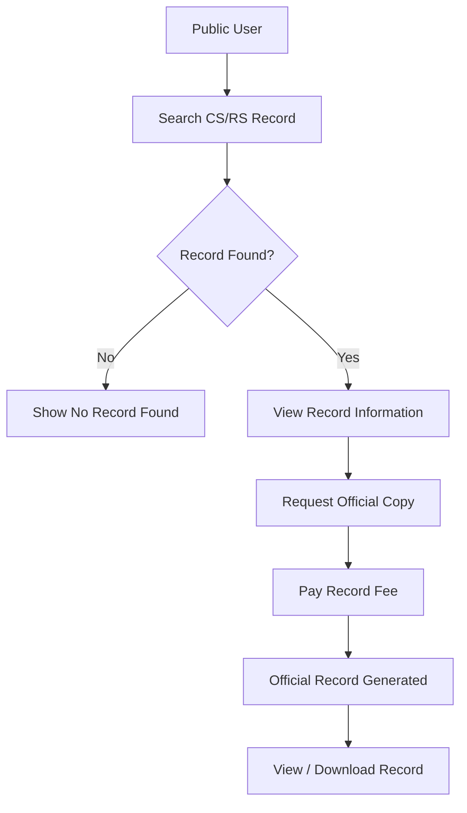

### 8.4 Public User — Land Map & Transaction Status

A Public User locates a parcel on the map, views the land record, current ownership, and transaction status. The status decides what is shown: availability, a transaction restriction, or updated ownership.

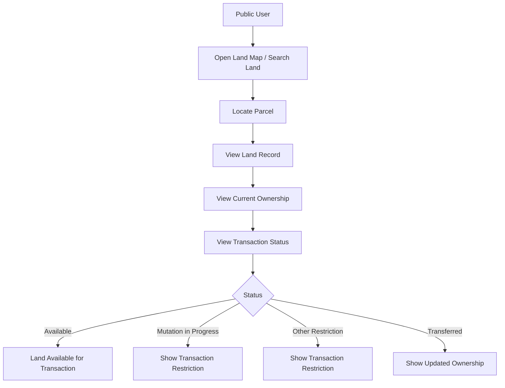

### 8.5 Dolil Lekhok — Deed Preparation & Submission

The Dolil Lekhok prepares the deed, supplies CS/RS information by **Upload** or **Import from Platform** (import requires the import fee), edits the generated template, pays the deed fees, and submits to the assigned Sub-Registrar.

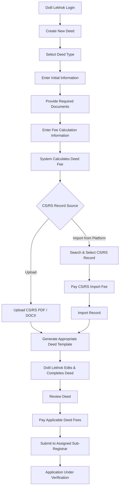

### 8.6 Sub-Registrar — Deed Verification & Approval

The Sub-Registrar reviews and verifies the deed. A rejection returns it to the Dolil Lekhok for correction and resubmission; an approval generates the Digital Dolil, stores it, **adds it to the Dolil Lekhok dashboard**, and notifies the Dolil Lekhok.

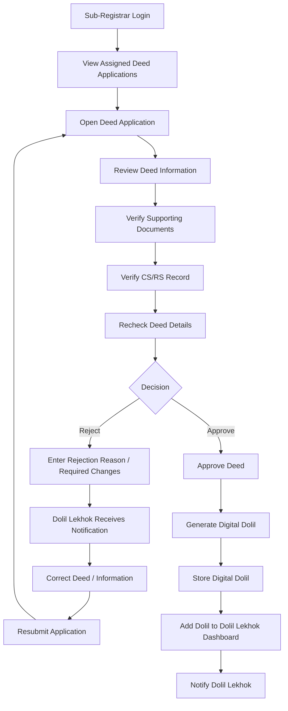

### 8.7 Dolil Lekhok — Apply for Mutation

From the dashboard, the Dolil Lekhok opens the approved Digital Dolil and mutation application. The Digital Dolil and CS/RS record are already attached, so the Dolil Lekhok reviews them, pays the mutation fee, and submits the request to the Mutation Officer.

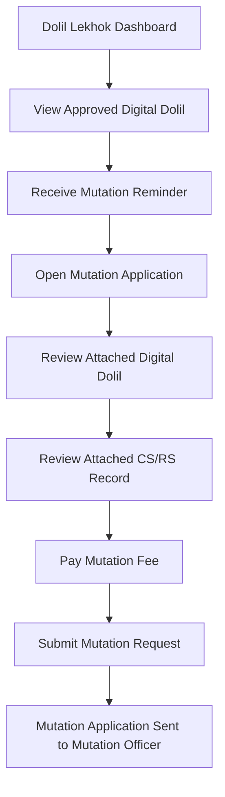

### 8.8 Mutation Officer — Mutation Verification & Approval

The Mutation Officer verifies the Digital Dolil, CS/RS record, ownership, land information, and existing transaction/mutation status. A rejection returns for correction and resubmission; an approval updates the RS/BS record and the current land transaction status, and notifies the Dolil Lekhok.

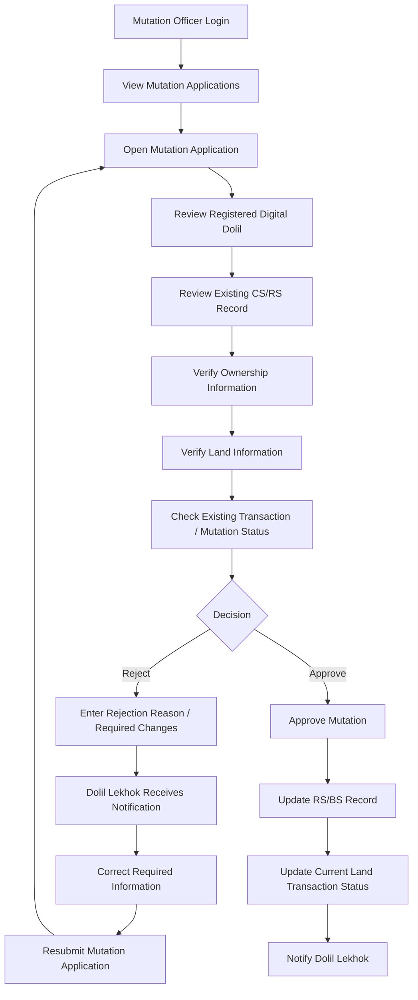

### 8.9 Public User — Land Status / Double-Selling Protection

A potential buyer searches a land record and the system checks its current transaction status. If a mutation is in progress, a warning is shown and the land cannot be used for new registration. This is a mechanism for detecting and preventing conflicting transactions based on recorded land and transaction status; it does not claim to eliminate fraud completely.

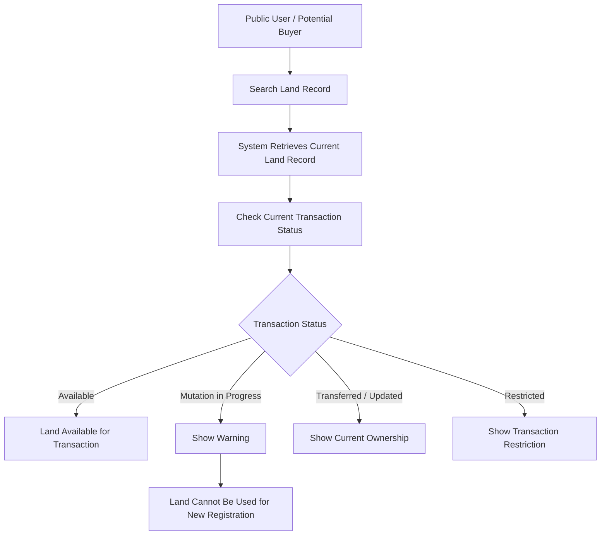

### 8.10 Administrator — User & Role Management

The Administrator creates, updates, and deactivates users and assigns or updates roles; all actions end by saving changes.

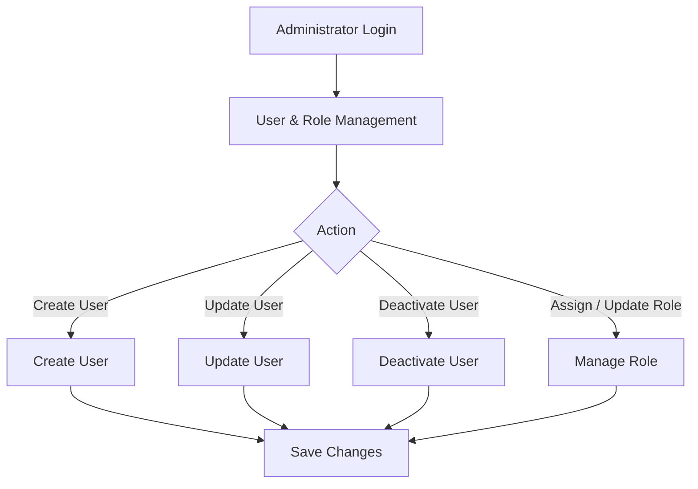

### 8.11 Administrator — Reports & Monitoring

The Administrator opens the admin dashboard, views system activity and statistics (deeds, mutations, payments, rejection/processing), and generates reports.

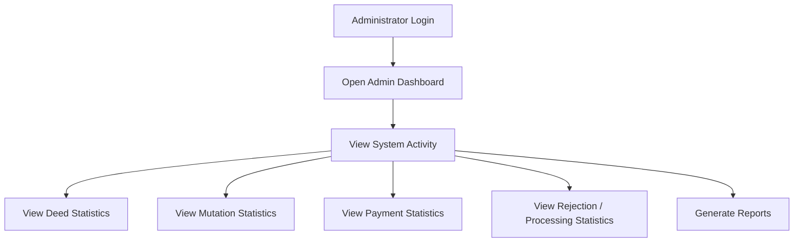

---

## 9. Non-Functional Requirements

> No arbitrary numerical targets are defined.

### 9.1 Security
Protect sensitive data and enforce role-based authorization.

### 9.2 Performance
Searches, dashboards, and workflows should remain responsive.

### 9.3 Usability
Interfaces should be understandable for citizens, Dolil Lekhoks, Sub-Registrars, and Mutation Officers.

### 9.4 Reliability
Transaction and land-record data must not be lost or corrupted.

### 9.5 Scalability
The architecture should support growth in users, records, and transactions.

### 9.6 Availability
Core services should remain reliably accessible.

### 9.7 Auditability
Important deed, mutation, payment, approval, rejection, and record-update activities should be traceable.

---

## 10. Security & Access Control

High-level expectations (no specific standard or technology is claimed unless implemented):

- **Authentication** of all non-public actions
- **Role-based access control** across the five user types
- **Role-specific dashboards** so users see only their own workflows
- **Secure document access** to deeds, supporting documents, and Digital Dolils
- **Land-record protection** and **prevention of unauthorized record modification** — RS/BS records change only through an approved mutation
- **Payment security** and payment integrity
- **Audit logs** and **record-change tracking** for approvals, rejections, payments, and record updates
- **Personal information protection**, including NID/personal data

| Area | Public | Dolil Lekhok | Sub-Registrar | Mutation Officer | Administrator |
| --- | :---: | :---: | :---: | :---: | :---: |
| Land tax, Dakhila, CS/RS search, land map, status | ✔ | ✔ | ✔ | ✔ | ✔ |
| Create, edit, submit deeds; import CS/RS | — | ✔ | — | — | — |
| Review, approve, reject deeds | — | — | ✔ | — | — |
| Apply for mutation | — | ✔ | — | — | — |
| Review, approve, reject mutation; trigger RS/BS update | — | — | — | ✔ | — |
| Users, roles, reports, notices, configuration | — | — | — | — | ✔ |
