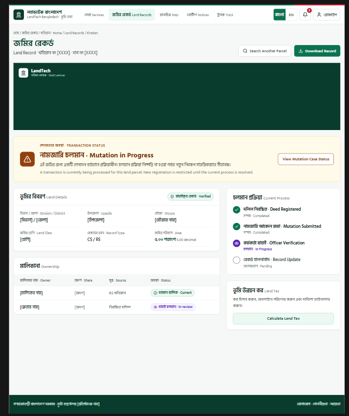
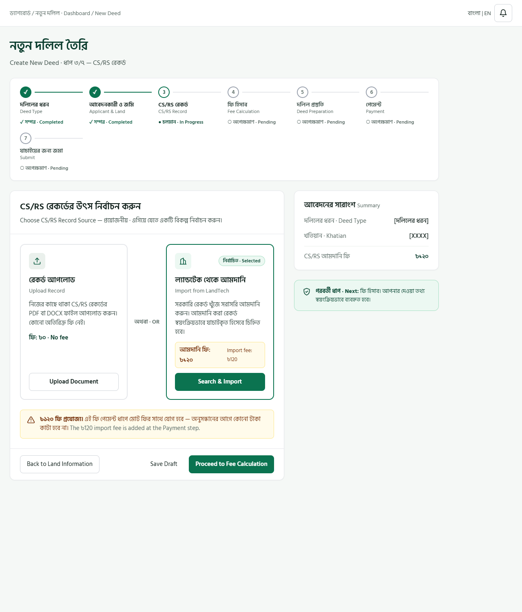
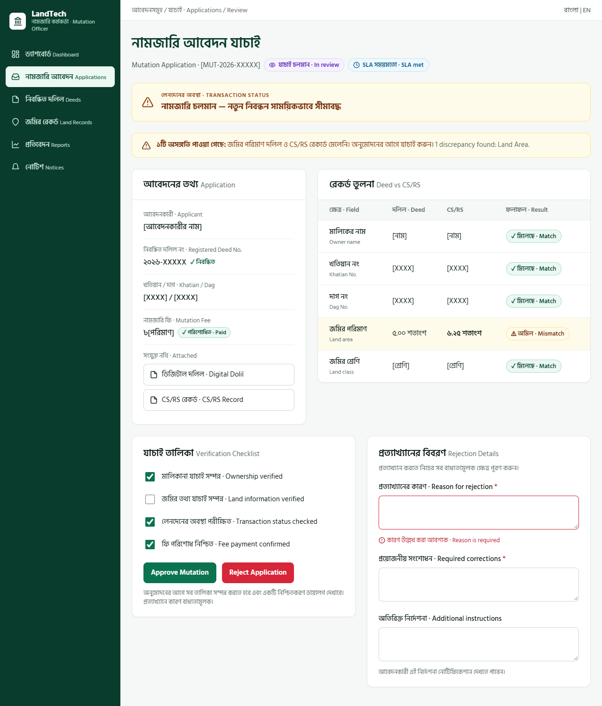
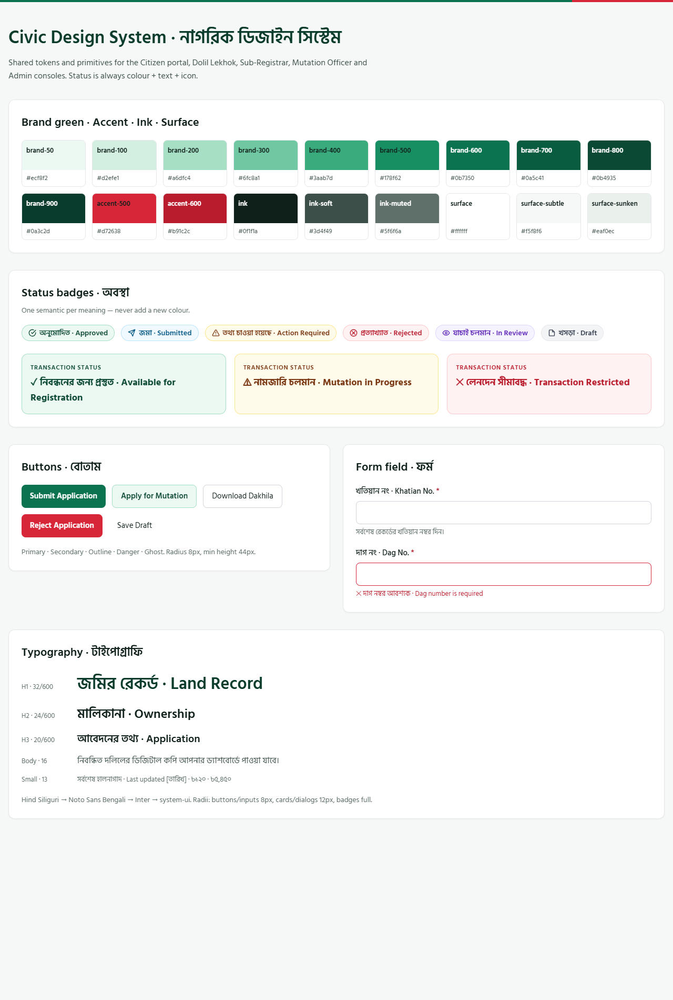
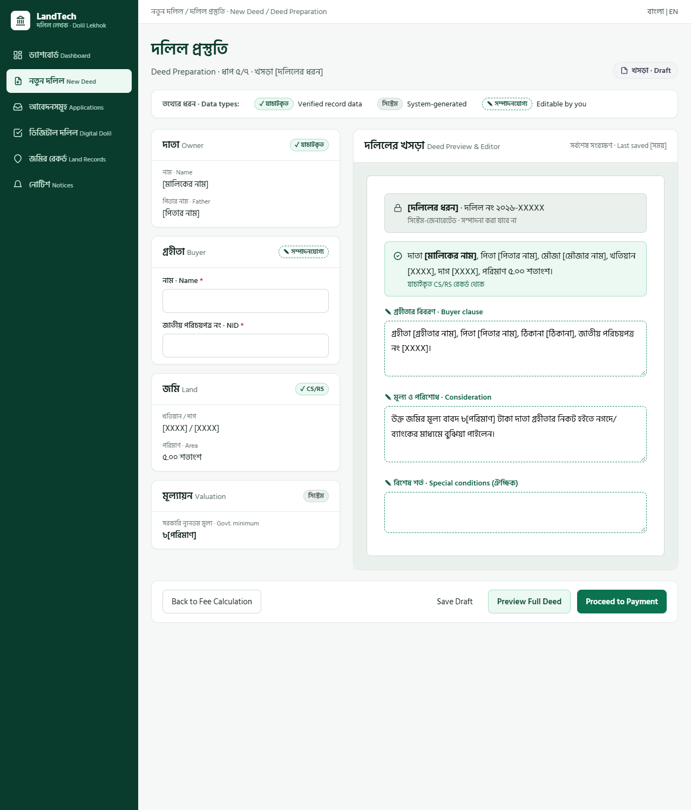
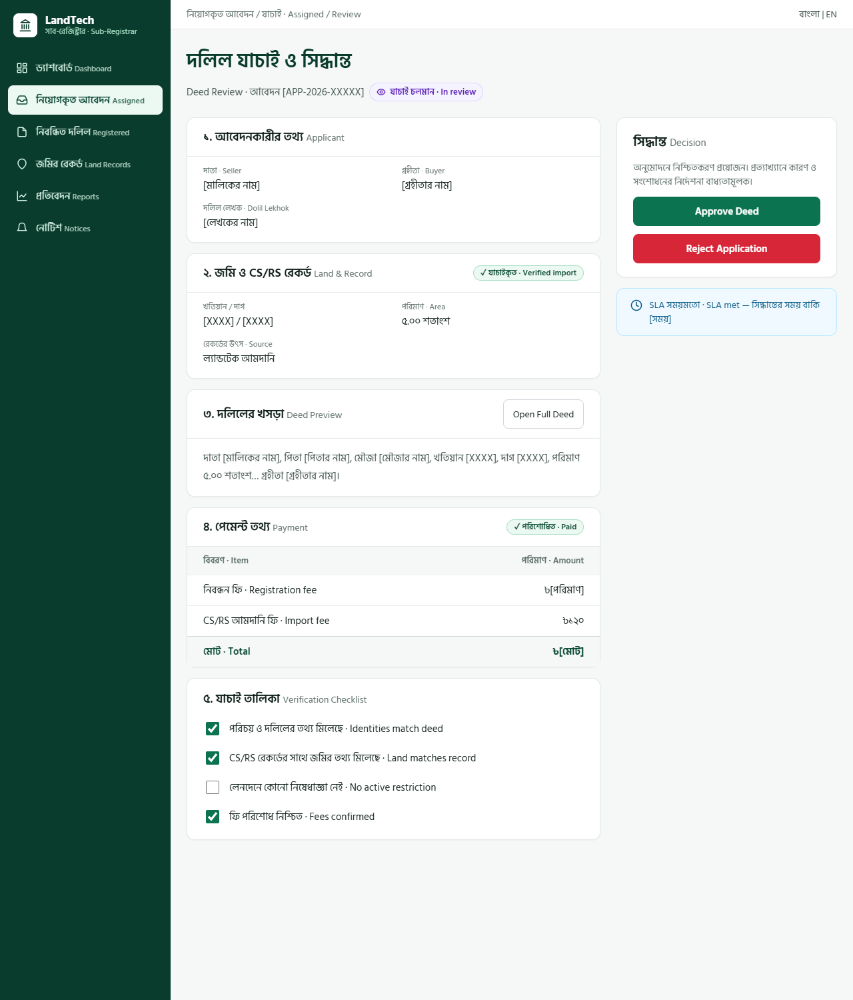
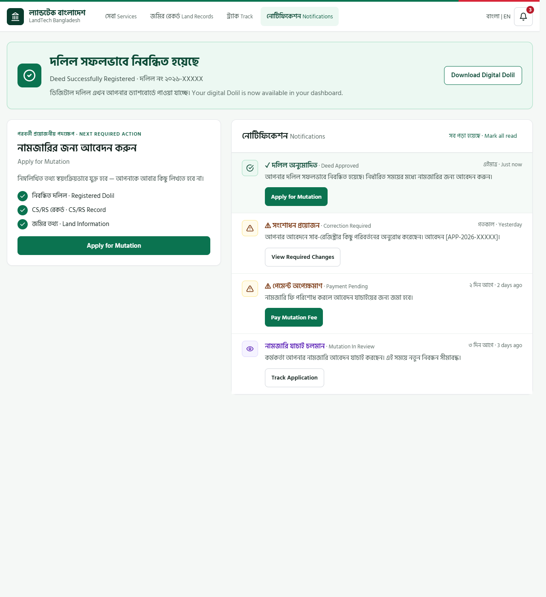

# BhumiLink Bangladesh — Design System & Agent Rules

> **Audience: any AI coding agent (Antigravity, Cursor, Copilot, Claude Code, Gemini, GPT, etc.), regardless of model.**
> This file is the single source of truth for all UI work in this repository.
> Read it fully before writing or editing any frontend code. If a request conflicts with this file, follow this file and tell the user about the conflict.

---

## 0. Non‑negotiable rules (read first)

1. **Product feel:** a Bangladesh *government* digital land service — trusted, formal, calm, legally credible. **Not** a startup/SaaS/fintech/gaming UI.
2. **Use only the tokens in §2–§5.** Never invent colors, radii, shadows, fonts, spacing values, or button styles. Never use pure `#000`.
3. **Reuse shared primitives (§8).** Before creating any component, search for an existing one. Never create `ButtonA`, `CustomButton`, `SpecialCard`, page-specific card styles, or new status colors.
4. **Status = color + text + icon, always.** Never color alone.
5. **Bilingual (বাংলা + English) everywhere.** Bengali is primary for citizen-facing UI. Never mix Bengali and English randomly inside one sentence.
6. **Transaction-safety status is the most prominent element on any land-record page** and must never be hidden inside a tab (§9.1).
7. **Accessibility (WCAG AA) is mandatory** (§11).
8. **Forbidden:** glassmorphism, neon, gradients (except the thin flag accent line), large pill containers, cartoon/decorative illustrations, emoji as UI icons, parallax, bouncing/decorative animation, Inter-only startup typography, marketing-sized headlines.
9. **No fake data presented as real.** Use `[placeholder]` or clearly sample values (e.g. `২০২৬-XXXXX`). Don't invent stats. **The reference images (§1) are design samples only — never copy their text/data as real content.**
10. **Keep consistency over creativity.** When unsure, copy the nearest existing screen.

---

## 1. Reference images (design samples — NOT content)

The approved visual design is captured in **8 reference images** stored in `assets/design-reference/`.

> ### ⚠️ These images are DESIGN SAMPLES, not content specifications
> - They show the **visual language and UI patterns** only: layout, spacing, colors, typography, component styling, density, tone, and structure.
> - **Do NOT copy their text, names, numbers, fields, or data as real content.** Everything inside them (e.g. `[মালিকের নাম]`, `২০২৬-XXXXX`, `৫.০০ শতাংশ`, fees, statuses, step contents, table rows) is **placeholder/sample data**.
> - **Do NOT assume the pages in the images are the only pages, or that a page must contain exactly what its sample shows.** A "Land Record" sample demonstrates how a land page should *look*; the real page's fields, sections, and data come from the actual requirements and backend.
> - When building a screen that isn't pictured, **compose it from the same patterns** (shell, cards, tables, badges, forms, status panels) — do not invent a new look.
> - Real copy, field lists, validation, and workflows come from the product requirements; use the images only to decide *how it should look and feel*.

**Before building or changing any UI, open the image whose *pattern* is closest to your task** and match its layout, density, spacing, colors, and component styling. If an image and the text in this file disagree on a token value, the token values in §2–§5 win; if they disagree on layout or look, the image wins.

| # | Image | Sample of | Pattern it demonstrates |
|---|---|---|---|
| 1 |  | Citizen detail page | Citizen header with flag accent line, prominent Transaction Status panel, details cards, ownership table, process timeline |
| 2 |  | Staff wizard step | Staff console shell (dark sidebar), 7‑step stepper, two-option choice cards (Upload vs paid Import), summary side card |
| 3 |  | Officer review page | Split review, Deed‑vs‑CS/RS comparison table, match/mismatch highlighting, checklist, approve/reject + required rejection form |
| 4 |  | Design-system sheet | Tokens, status badges, buttons, form fields, typography |
| 5 |  | Document editor | Structured-data column + document preview; distinguishing Verified / System‑generated / Editable data |
| 6 |  | Decision/approval page | Ordered review sections, payment table, checklist, decision panel, confirmation & rejection dialogs |
| 7 |  | Success + notification feed | Success banner, "next required action" card with auto‑filled items, action‑oriented notification list |


Which image to use for which kind of task (by pattern, not by page name):
- Citizen-facing pages, detail views, public header/footer → **images 1, 7**
- Any staff/officer/admin page (sidebar shell, wizards, multi-step forms) → **images 2, 5, 6**
- Review, verification, comparison, approve/reject, dialogs → **images 3, 6**
- Document/long-form editing with mixed data types → **image 5**
- Notifications, success states, next-action prompts → **image 7**
- Any new component, badge, button, form field, or color decision → **image 4**

New screens must look like they belong to this same set. In your final message after UI work, state which reference image(s) you took the *pattern* from, and confirm you used real/requirement-driven content rather than the sample text.

## 2. Color tokens

### Brand green (dominant identity)
| Token | Hex | Use |
|---|---|---|
| brand-50 | `#ecf8f2` | active nav bg, soft selected, success badge bg |
| brand-100 | `#d2efe1` | hover highlight, sidebar text |
| brand-200 | `#a6dfc4` | badge borders, section accents |
| brand-300 | `#6fc8a1` | subtle card hover |
| brand-400 | `#3aab7d` | secondary interactive |
| brand-500 | `#178f62` | accents, focus-related |
| **brand-600** | **`#0b7350`** | **PRIMARY ACTION** |
| brand-700 | `#0a5c41` | primary hover, links |
| brand-800 | `#0b4935` | strong headings, important totals, success text |
| brand-900 | `#0a3c2d` | staff/admin sidebar, footer, high-emphasis nav |

### Bangladesh red (semantic only — errors/rejections/destructive/urgent/required `*`/unread dot)
`accent-500 #d72638` (danger button bg) · `accent-600 #b91c2c` (error text, required marker, hover)
Never use red decoratively. Only exception: the 4px flag accent line in the header (green bar + short red segment).

### Text
`ink #0f1f1a` (headings, primary data) · `ink-soft #3d4f49` (secondary) · `ink-muted #5f6f6a` (metadata, hints, table headers)

### Surfaces
`surface #ffffff` (cards, inputs) · `surface-subtle #f5f8f6` (app background, table headers) · `surface-sunken #eaf0ec` (secondary areas, ghost hover, row dividers)
Card border `#e5e7eb`. Input border `#d1d5db`.

### Status palette (Tailwind names)
| Meaning | bg | text | border | Icon (Lucide) | Use for |
|---|---|---|---|---|---|
| Success | brand-50 | brand-800 | brand-200 | `CheckCircle2` / `ShieldCheck` | Approved, Completed, Resolved, Verified, Paid, Match |
| Submitted/Pending | sky-50 | sky-800 | sky-200 | `Clock` `Send` `Inbox` | Submitted, Received, Pending, SLA met |
| Warning/Action | amber-50 | amber-800 | amber-200 | `AlertTriangle` | Payment pending, Info requested, Due soon, Mismatch, Mutation in progress |
| Rejected/Critical | red-50 | red-700 | red-200 | `XCircle` `AlertCircle` | Rejected, Failed, SLA breached, Transaction restricted |
| Processing | violet-50 | violet-800 | violet-200 | `Loader` `Eye` `ClipboardCheck` | Assigned, In review, In progress |
| Inactive | gray-100 | gray-700 | gray-200 | `FileText` | Draft, Cancelled, Expired, Paused |

### Map category colors (readability beats branding)
PARK `#2E7D32` · PUBLIC_TOILET `#0277BD` · HOSPITAL `#C62828` · MARKET `#E65100` · AUDITORIUM `#6A1B9A` · INFRA `#455A64` · WARD_OFFICE `#00695C` · WASTE_ZONE `#795548`. Base map: muted neutral land tones.

---

## 3. Typography

Font stack (exact): `"Hind Siliguri", "Noto Sans Bengali", "Inter", system-ui, sans-serif`
Load Hind Siliguri 400/500/600/700 + Noto Sans Bengali 400/600 from Google Fonts. Hind Siliguri is primary for Bengali.

| Role | Size | Weight |
|---|---|---|
| H1 | 30–36px | 600 |
| H2 | 24–28px (card titles 20–22px) | 600 |
| H3 | 18–22px | 600 |
| Body | 15–16px | 400 |
| Small / metadata | 13–14px | 400 |
| Table | 14–15px | 400 (headers 13px/600, ink-muted) |

Line-height ≥ 1.5 for Bengali body text. No oversized marketing type. Use `text-wrap: pretty` where available.

---

## 4. Radius, shadow, spacing, motion

- **Radius:** buttons/inputs `rounded-lg` (8px) · cards/dialogs `rounded-xl` (12px) · badges `rounded-full`. Nothing larger.
- **Shadow:** only `0 1px 2px rgba(15,31,26,.04)` on cards (plus 1px border). Dropdown/dialog may use one slightly stronger shadow, defined once.
- **Spacing scale (px):** 4, 8, 12, 16, 20, 24, 32, 40, 48, 64. No arbitrary values.
- **Page container:** `max-w-7xl mx-auto px-4` (1280px).
- **Touch targets:** ≥ 44×44px for every button, input, nav item, checkbox row.
- **Motion:** subtle only — loading, page transitions, dropdowns, dialogs, status changes, notification appearance. 150–200ms ease. Respect `prefers-reduced-motion`.

---

## 5. Implementation tokens (copy exactly)

### CSS variables
```css
:root {
  --brand-50:#ecf8f2; --brand-100:#d2efe1; --brand-200:#a6dfc4; --brand-300:#6fc8a1;
  --brand-400:#3aab7d; --brand-500:#178f62; --brand-600:#0b7350; --brand-700:#0a5c41;
  --brand-800:#0b4935; --brand-900:#0a3c2d;
  --accent-500:#d72638; --accent-600:#b91c2c;
  --ink:#0f1f1a; --ink-soft:#3d4f49; --ink-muted:#5f6f6a;
  --surface:#ffffff; --surface-subtle:#f5f8f6; --surface-sunken:#eaf0ec;
  --border:#e5e7eb; --border-input:#d1d5db;
  --shadow-card:0 1px 2px rgba(15,31,26,.04);
  --font-sans:"Hind Siliguri","Noto Sans Bengali","Inter",system-ui,sans-serif;
}
body { background:var(--surface-subtle); color:var(--ink); font-family:var(--font-sans); }
:focus-visible { outline:2px solid #0b7350; outline-offset:2px; }
```

### Tailwind (`tailwind.config`)
```js
theme: { extend: {
  colors: {
    brand: { 50:'#ecf8f2',100:'#d2efe1',200:'#a6dfc4',300:'#6fc8a1',400:'#3aab7d',500:'#178f62',600:'#0b7350',700:'#0a5c41',800:'#0b4935',900:'#0a3c2d' },
    accent: { 500:'#d72638', 600:'#b91c2c' },
    ink: { DEFAULT:'#0f1f1a', soft:'#3d4f49', muted:'#5f6f6a' },
    surface: { DEFAULT:'#ffffff', subtle:'#f5f8f6', sunken:'#eaf0ec' },
  },
  fontFamily: { sans: ['"Hind Siliguri"','"Noto Sans Bengali"','Inter','system-ui','sans-serif'] },
  boxShadow: { card: '0 1px 2px rgba(15,31,26,.04)' },
}}
```
Put tokens in **one** place (CSS vars / Tailwind config / theme file). Components consume tokens; pages never hard-code hex.

---

## 6. Bilingual rules

- Every important label has **Bengali primary + English secondary**: `জমির রেকর্ড` / `Land Record`. Pattern: Bengali in normal weight/size, English in `ink-muted`, 13–14px, on the same line after `·` or on a second line.
- Language switcher (`বাংলা | EN`) in the header/top bar, same position on every screen, `aria-pressed` toggle, ≥44px.
- Use an i18n layer (e.g. `t('landRecord.title')`); **no hard-coded strings** in components. Keep one terminology glossary (below).
- Use **Bengali numerals** (০১২৩৪৫৬৭৮৯) in the Bengali UI, Latin digits in English UI. Currency `৳`, comma-grouped: `৳১২০`, `৳৫,৪৫০` / `৳120`, `৳5,450`. Use one `formatCurrency()` helper across fees, import fee, mutation fee, land tax, receipts, reports.
- Staff consoles may show bilingual labels side by side; citizen UI defaults to Bengali.
- Use `lang="bn"` / `lang="en"` on text blocks for screen readers.

**Glossary (keep consistent):** Land Record = জমির রেকর্ড · Mutation = নামজারি · Deed = দলিল · Dolil Lekhok = দলিল লেখক · Sub‑Registrar = সাব‑রেজিস্ট্রার · Khatian = খতিয়ান · Dag = দাগ · Mouza = মৌজা · Dakhila = দাখিলা · Land Tax = ভূমি উন্নয়ন কর · CS/RS record = CS/RS রেকর্ড · Decimal = শতাংশ.

---

## 7. Layout shells

### 7.1 Citizen portal
Sticky white header → 4px flag accent line (green bar, short red segment at right) → logo/identity left → nav (Services · Land Records · Map · Notices · Track) → language switcher, notifications bell (red unread count), profile menu. Header is **not oversized**. Main content in `max-w-7xl`. Footer in brand-900.

### 7.2 Staff / officer console (Dolil Lekhok, Sub‑Registrar, Mutation Officer, Admin)
- Sidebar **256px**, bg `brand-900 #0a3c2d`, text brand-100, Lucide icon + label, grouped sections. Active item: bg brand-50 / text brand-800 / weight 600, `aria-current="page"`.
- Top bar (white, bordered): breadcrumb left; language + notifications right.
- Page header: H1 (brand-900), subtitle, primary actions on the right.
- **Mobile:** sidebar becomes off‑canvas drawer with dark overlay and an accessible close button; content stacks.
- Layout must be fluid (flex/grid with wrap), never fixed-width on pages.

---

## 8. Shared primitives (build once, reuse everywhere)

`Button, Input, Select, Textarea, Checkbox, Field, Card, CardHeader, Modal/Dialog, Badge, Alert, StatusBadge, StatusStepper, TransactionStatusPanel, ComparisonTable (DiffRow), DataTable, Tabs, Pagination, Toast/Notification, EmptyState, Sidebar, Header.`

### Button
| Variant | Style |
|---|---|
| primary | `bg #0b7350`, hover `#0a5c41`, white text, weight 600 |
| secondary | bg brand-50, text brand-800, border brand-200 |
| outline | white bg, border `#d1d5db`, text ink |
| danger | bg `#d72638`, hover `#b91c2c`, white text |
| ghost | transparent, hover bg surface-sunken |

`rounded-lg`, min-height 44px, padding 0 16px, 15px text. **Action labels must be specific:** `Submit Application`, `Approve Deed`, `Reject Application`, `Apply for Mutation`, `Download Dakhila`, `Import CS/RS Record`, `Proceed to Fee Calculation`. Never “Continue / Go / Process / Do it”. One primary button per view area.

### Card
White, `1px solid #e5e7eb`, `rounded-xl`, `shadow-card`. Header row: title (20–22px/600, Bengali + muted English) with optional right-aligned badge/actions, bottom border. Avoid nested cards.

### StatusBadge
`rounded-full`, 13px/600, padding `2–3px 10–12px`, 1px border, **icon (14–15px) + text**. Source of truth is one `status → {bg,text,border,icon,labelBn,labelEn}` map (§2). Never restyle per page.

### Form Field
Visible `<label for>` (never placeholder-only), required `*` in accent-600 with `aria-hidden` (plus `required` attr), helper text (13px ink-muted), input `rounded-lg border-gray-300 min-h-44px`, focus ring `ring-brand-500/30` + visible outline. **Error state:** border `accent-500` + message text `accent-600` **with an icon/“✕” and text**, `aria-invalid="true"`, `aria-describedby`. Never rely on border color alone.

### DataTable
Real `<table>` with `<th scope>`; header bg surface-subtle, 13px/600 ink-muted; primary data ink, secondary ink-soft, metadata ink-muted; row dividers `#eaf0ec`; wrap in `overflow-x:auto` with `min-width`; sortable, filterable, searchable, paginated for large sets; compact StatusBadges.

---

## 9. Domain patterns (the product’s core)

### 9.1 Transaction‑safety status panel (fraud prevention) — highest visual priority
Shown **at the top** of every land-record view, above ordinary metadata, never inside a tab. Label `লেনদেনের অবস্থা · TRANSACTION STATUS` (12px caps, tracking) + large title (24–26px/700) + Bengali explanation + English line.

| State | Look | Copy |
|---|---|---|
| Available | green panel, `CheckCircle2` | ✓ নিবন্ধনের জন্য প্রস্তুত · Available for Registration |
| Mutation in progress | amber panel (`#fffbeb` / border `#fde68a` / title `#78350f`), `AlertTriangle` in solid `#92400e` square | ⚠ নামজারি চলমান · Mutation in Progress — new registration is temporarily restricted until the current process is resolved |
| Restricted | red panel (`red-50`/`red-200`/`red-700`), `XCircle` | ✕ লেনদেন সীমাবদ্ধ · Transaction Restricted |

Include a clear action (e.g. “View Mutation Case Status”). Compact version (icon + label + title) is reused on officer review screens.

### 9.2 Dolil Lekhok guided flow — 7‑step stepper
1 Deed Type → 2 Applicant & Land Information → 3 CS/RS Record → 4 Fee Calculation → 5 Deed Preparation → 6 Payment → 7 Submit for Verification.
Each step shows number/check, Bengali + English title, and state text: `✓ সম্পন্ন · Completed` (brand green, filled circle) · `● চলমান · In Progress` (brand outline) · `○ অপেক্ষমাণ · Pending` (gray). The user must always see: where they are, what’s done, what’s left, what’s required, the next action. Footer actions: `Back…`, `Save Draft` (ghost), primary next action with explicit label. Show a running summary card.

### 9.3 CS/RS record source choice
Two equal cards separated by `অথবা · OR`:
- **Upload Record** — PDF/DOCX, fee ৳০, button `Upload Document` (outline).
- **Import from BhumiLink** — search official record, **visible amber fee chip “আমদানি ফি: ৳১২০ · Import fee: ৳120” on the card before any action**, button `Search & Import` (primary).
Selected card: 2px brand-600 border + “নির্বাচিত · Selected” badge. When import is selected, show an amber notice that the fee is added at Payment. **Never hide the paid fee.**

### 9.4 Deed editor
Two columns: left structured information (Owner, Buyer, Land, Valuation, Deed Type); right editable deed preview. Visually distinguish **System‑generated** (locked, gray bg + lock icon), **User‑editable** (white, editable outline), **Verified record data** (green check badge). Dolil Lekhok can edit appropriate parts only.

### 9.5 Sub‑Registrar review
Order: Application → Applicant → Land → CS/RS record → Deed preview → Payment → Verification checklist → Approve/Reject. Approve requires a confirmation dialog. **Reject requires** Reason (required), Required corrections (required), Additional instructions (optional) — block submit and show inline errors if empty.

### 9.6 Mutation workflow
After deed approval show a prominent success block: `✓ দলিল সফলভাবে নিবন্ধিত · Deed Successfully Registered` → “Digital Dolil is now available in your dashboard.” → **Next Required Action: Apply for Mutation** + `Apply for Mutation` button. The mutation form must **auto‑fill** and show `Registered Dolil ✓ · CS/RS Record ✓ · Land Information ✓` — never ask users to re‑enter known data.

### 9.7 Mutation Officer review
Split layout: left application details, right source documents / comparison. Flow: Application → Registered Deed → Existing CS/RS → Ownership verification → Land verification → Transaction status → Approve/Reject. Comparison table columns `Field | Deed | CS/RS | Result`; **Match** = success badge `✓ মিলেছে · Match`; **Mismatch** = amber row tint `#fffbeb` + `⚠ অমিল · Mismatch` + bold differing value; show a top alert summarizing discrepancy count.

### 9.8 Notifications
Action‑oriented, never vague: icon + bold title + one clear sentence + next step + action button. e.g. `✓ Deed Approved — Your deed has been successfully registered. Next step: Apply for mutation within the required period. [Apply for Mutation]` / `⚠ Correction Required — … [View Required Changes]`. Unread = small accent-500/600 badge.

### 9.9 Core journeys the UI must support consistently
Citizen: Search Land → View Record → Check Ownership → Check Transaction Status · Land Tax: Land Info → Tax Calculation → Payment → Dakhila · Dolil Lekhok: Create Deed → … → Submit · Sub‑Registrar: Review → Verify → Approve/Reject → Digital Dolil · Mutation: Approved Dolil → Notification → Payment → Request → Officer Verification → Approve/Reject → RS/BS Update · Fraud prevention: Search → Current Record → Transaction Status → Mutation in Progress → Registration Restricted.

---

## 10. Responsive behavior

- Desktop container 1280px. Use `flex-wrap`/`grid auto-fit minmax(min(Npx,100%),1fr)`; no fixed page widths.
- Mobile ≠ compressed desktop: stack cards, collapse nav (off‑canvas drawer), tables scroll horizontally inside a box, keep primary action visible (sticky bottom action bar where needed), forms stay usable, stepper wraps to a grid.
- Test at 390px and 1280px.

---

## 11. Accessibility checklist (blocking)

- Global `:focus-visible { outline:2px solid #0b7350; outline-offset:2px }`; every interactive element keyboard reachable with visible focus.
- Use real `<button>`, `<a href>`, `<input>`+`<label>`, `<table>`+`<th scope>`. Never `div onClick`. Icon-only buttons need `aria-label`.
- Contrast ≥ 4.5:1 (3:1 for ≥24px). Text on `brand-500` and lighter uses `ink`, not white. Caption gray must be `ink-muted` or darker.
- Meaningful icons have adjacent text or `aria-label`; decorative icons `aria-hidden="true"`.
- Dialogs: focus trap, Esc to close, return focus, `aria-modal`, labelled title.
- Errors/alerts: `role="alert"`/`role="status"`, plain-language messages, in both languages.
- Bengali stays readable at 200% zoom; no text clipping.
- Honor `prefers-reduced-motion`.

---

## 12. Icons

**Lucide only.** Never mix icon libraries; no emoji as UI glyphs. Stroke 2, sizes 14–20px (30px inside the transaction panel). Core set: `FileText Landmark Map MapPin User Users Search Upload Download CreditCard Bell CheckCircle2 XCircle AlertTriangle AlertCircle Clock Eye ShieldCheck ClipboardCheck FileCheck RefreshCw Send Inbox Loader Lock`.

---

## 13. Agent workflow (follow every time)

1. Read this file, open the matching reference image from `assets/design-reference/` (§1), and open the nearest existing screen/component.
2. Search for an existing primitive. Extend it with a variant rather than forking.
3. Use tokens only; strings via i18n with bn + en; numbers/currency via helpers.
4. Build the status with the shared `StatusBadge`; build land pages with `TransactionStatusPanel` first.
5. Verify against the **Pre‑merge checklist**.

### Pre‑merge checklist
- [ ] Used reference images for look/pattern only — no sample text/data copied as real content
- [ ] Only tokens from §2–§5 used (no stray hex, radius, shadow, font)
- [ ] Reused shared primitives; no duplicate component or page-specific card style
- [ ] Every status = color + icon + text, from the central map
- [ ] Bengali primary + English secondary; no hard-coded strings; correct numerals & ৳ formatting
- [ ] Transaction status visible on land-record views, not in a tab
- [ ] Paid import fee (৳120) visible before action
- [ ] Rejection cannot be submitted without reason + corrections
- [ ] Labels are specific action verbs
- [ ] Keyboard + focus + labels + contrast + dialog a11y pass
- [ ] Looks correct at 390px and 1280px; tables scroll inside a box
- [ ] No gradients (except flag line), glass, neon, big pills, decorative animation, emoji icons

**Final test:** *“Could this screen plausibly ship from a Bangladesh government department, and does it look like the same platform as every other BhumiLink screen?”* If not, revise.
